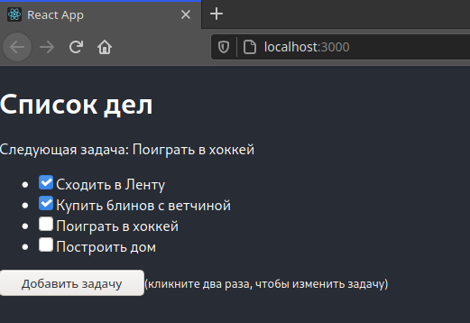

# ToDo application
React + Mobx Todo list as implementation of pattern state and observer

---
### How to start

````
1. Clone this repository
2. $ yarn or npm install
3. $ yarn start or npm run start 
````
------

### Expected Result:

